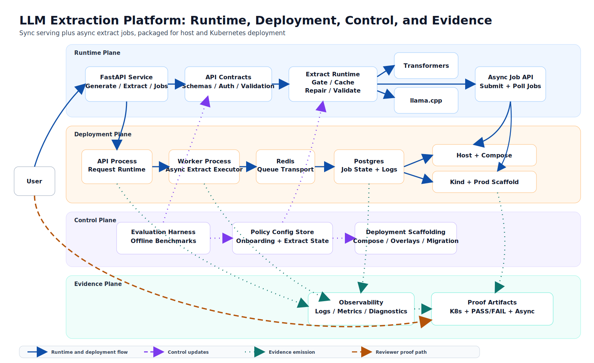

# LLM Extraction Platform

Production-style LLM application service for serving generate and schema-constrained extract capabilities with explicit contracts, policy-aware runtime behavior, and test-first reliability across multiple deployment modes.

## Why This Project Exists

This repository exists to solve a concrete systems problem:

- expose LLM-backed product behavior through explicit backend APIs
- enforce extraction capability and policy at runtime instead of relying on prompts alone
- validate structured outputs against clear contracts
- make behavior inspectable through proof artifacts, tests, and operational diagnostics

As a hiring surface, it also demonstrates:

- building and operating LLM-backed product features
- designing backend APIs with clear contracts
- evaluating model behavior and enforcing policy decisions
- shipping reliable systems with CI, integration tests, and operational diagnostics

## How To Review This Repo

Recommended review flow (5-10 minutes):
1. Read the proof system summary below.
2. Run `python proof/generate_canonical_manifest.py`.
3. Inspect `proof/evidence_manifest.latest.json` and `proof/proof_points.latest.md`.
4. Open the docs index for deeper technical references.

Deep index: [`docs/README.md`](docs/README.md)
Quick skim summary: [`PORTFOLIO_ONE_PAGER.md`](PORTFOLIO_ONE_PAGER.md)

## Proof System

Canonical proof command:
```bash
python proof/generate_canonical_manifest.py
```

Canonical proof bundle:
- Contract: [`proof/evidence_contract.schema.json`](proof/evidence_contract.schema.json)
- Manifest: [`proof/evidence_manifest.latest.json`](proof/evidence_manifest.latest.json)
- Summary: [`proof/proof_points.latest.md`](proof/proof_points.latest.md)
- Validation:
```bash
python proof/validate_evidence_manifest.py
```

Core proof points:
1. `Generate Clamp`
   - Claim: runtime policy applies a token cap when SLO conditions require it.
   - Signal: control and clamp manifests encode divergent expected outcomes.
2. `Extract Gate PASS/FAIL`
   - Claim: onboarding artifacts drive runtime extract capability enforcement.
   - Signal: PASS and FAIL runtime outputs diverge as expected.
3. `Kubernetes kind Deployment`
   - Claim: the generate-only service runs on local `kind`, and the production scaffold renders cleanly.
   - Signal: rollout, health, and smoke checks pass; both overlays render.
4. `Async Extract Jobs`
   - Claim: extract requests can be queued, executed by a separate worker, and resolved through a job-status API.
   - Signal: submit returns `202`, worker execution is logged separately, and final job state succeeds with a valid result.
5. `Traceable Request Inspection`
   - Claim: sync and async extract flows can be inspected as ordered per-request timelines.
   - Signal: sync and async trace detail artifacts exist, and the async timeline shows submission, worker, and status-poll lineage.

What this proof system is meant to show:
- explicit API and policy contracts
- runtime enforcement of model capabilities
- reproducible deployment evidence
- async workflow execution with durable state
- request-level inspection across sync and async extract paths

What it does not claim:
- production-scale GPU scheduling
- autoscaling under real traffic
- large-scale distributed systems operation beyond the scoped proof paths

## Skills Demonstrated

### 1) LLM Systems Engineering
- Generate and schema-constrained extract capabilities with explicit gating.
- Evidence: [`server/README.md`](server/README.md), [`policy/README.md`](policy/README.md), [`schemas/README.md`](schemas/README.md)

### 2) Backend/API Design
- Versioned endpoints, auth/limits, health/readiness, and structured error contracts.
- Evidence: [`docs/01-extraction-contract.md`](docs/01-extraction-contract.md), [`server/README.md`](server/README.md)

### 3) Evaluation and Policy Lifecycle
- Offline evaluation artifacts feed policy/onboarding decisions that affect runtime behavior.
- Evidence: [`eval/README.md`](eval/README.md), [`policy/README.md`](policy/README.md), [`docs/02-project-demos.md`](docs/02-project-demos.md)

### 4) Reliability and Test Infrastructure
- Unit/integration/live coverage split across services with CI execution.
- Evidence: [`docs/00-testing.md`](docs/00-testing.md), [`.github/workflows/ci.yml`](.github/workflows/ci.yml)

### 5) Deployment and Operability
- Host, container, and Kubernetes deployment modes with reproducible scripts and diagnostics capture.
- Evidence: [`deploy/README.md`](deploy/README.md), [`scripts/README.md`](scripts/README.md), [`docs/03-deployment-modes.md`](docs/03-deployment-modes.md)

### 6) Async Workflow and Queueing
- Extraction can run through a durable async job path backed by Postgres job state and a separate Redis-driven worker process.
- Evidence: [`proof/README.md`](proof/README.md), [`docs/03-deployment-modes.md`](docs/03-deployment-modes.md)

## Architecture At A Glance



- `server/`: runtime API for generate/extract/admin health and readiness.
- `policy/`: policy decision engine and onboarding logic.
- `eval/`: evaluation jobs and reporting pipeline.
- `contracts/` + `schemas/`: validation layer and schema specs.
- `integrations/`: repo-level end-to-end and live integration scenarios.
- `ui/`: frontend surfaces for interacting with the system.

## 10-Minute Reviewer Path

1. Read architecture and scope:
- [`docs/03-deployment-modes.md`](docs/03-deployment-modes.md)
- [`docs/01-extraction-contract.md`](docs/01-extraction-contract.md)

2. Generate the canonical proof bundle:
```bash
python proof/generate_canonical_manifest.py
```

3. Validate the proof contract:
```bash
python proof/validate_evidence_manifest.py
```

4. Inspect the latest proof outputs:
- [`proof/evidence_manifest.latest.json`](proof/evidence_manifest.latest.json)
- [`proof/proof_points.latest.md`](proof/proof_points.latest.md)
- `proof/artifacts/phase5_k8s_kind/`
- `proof/artifacts/phase6_extract_async/`
- `proof/artifacts/phase7_trace_inspection/`

5. Review CI and tests:
- [`.github/workflows/ci.yml`](.github/workflows/ci.yml)
- [`docs/00-testing.md`](docs/00-testing.md)

6. Review interview packet (architecture, tradeoffs, failure modes):
- [`docs/11-interview-packet.md`](docs/11-interview-packet.md)

## Testing And CI Signals

- Service-level unit and integration suites in `server/`, `policy/`, `eval/`, `ui/`.
- Repo-level integration suites in `integrations/`.
- CI matrix in [`.github/workflows/ci.yml`](.github/workflows/ci.yml).

## Repository Map

- [`cli/README.md`](cli/README.md)
- [`config/README.md`](config/README.md)
- [`contracts/README.md`](contracts/README.md)
- [`deploy/README.md`](deploy/README.md)
- [`docs/README.md`](docs/README.md)
- [`eval/README.md`](eval/README.md)
- [`integrations/README.md`](integrations/README.md)
- [`policy/README.md`](policy/README.md)
- [`schemas/README.md`](schemas/README.md)
- [`scripts/README.md`](scripts/README.md)
- [`server/README.md`](server/README.md)
- [`simulations/README.md`](simulations/README.md)
- [`tools/README.md`](tools/README.md)
- [`ui/README.md`](ui/README.md)

## Future Improvements

### Near-term
- Broaden integration smoke coverage for async worker and deployment/profile variants.
- Add a compact operations runbook for common failure modes (`worker down`, `Redis unavailable`, rollout probe failures).
- Expand the reviewer quickstart with expected outputs and artifact screenshots.

### Mid-term
- Deepen evaluation rigor with clearer error taxonomy, regression summaries, and confidence reporting.
- Calibrate policy thresholds from traffic/eval statistics and document the tuning loop.
- Add SLO dashboards and incident-response walkthrough docs.
- Formalize dataset/prompt versioning and lineage docs.
- Prepare a future gateway-backed deployment mode by defining a stable boundary for a separate Go `inference-serving-gateway` service. See [`docs/service-boundary.inference-serving-gateway.md`](docs/service-boundary.inference-serving-gateway.md).

### Long-term
- Add additional serving backends (for example vLLM/TGI) with benchmark docs.
- Build model lifecycle governance docs (onboarding/offboarding/rollback).
- Add cost-performance optimization framework and reporting.
- Add security hardening docs (threat model, abuse tests, supply-chain controls).

## License

MIT License. See [`LICENSE`](LICENSE).
