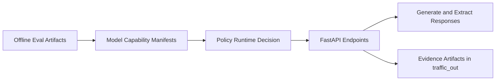

# Interview Packet: LLM Extraction Platform

## Architecture Snapshot

## Key Design Decision
Extraction capability is treated as a policy-governed runtime feature, not a prompt-only behavior. Offline onboarding results determine runtime allow/deny behavior for schema-constrained extraction.

## Failure Modes
- Unsupported model appears to produce extraction output but violates schema reliability expectations.
- Contract drift between schema definitions and runtime behavior.
- Operational regressions hidden without deterministic evidence capture.

## Tradeoffs
- Strict gating increases reliability and trust but may reduce immediate model availability.
- Deterministic artifact requirements improve reviewability with added process overhead.
- Multi-runtime support broadens deployment options while increasing integration complexity.

## Next 90 Days
- Add extraction error taxonomy and confidence reporting.
- Expand onboarding/offboarding governance documentation.
- Add benchmark reporting for latency, cost, and quality tradeoffs.
